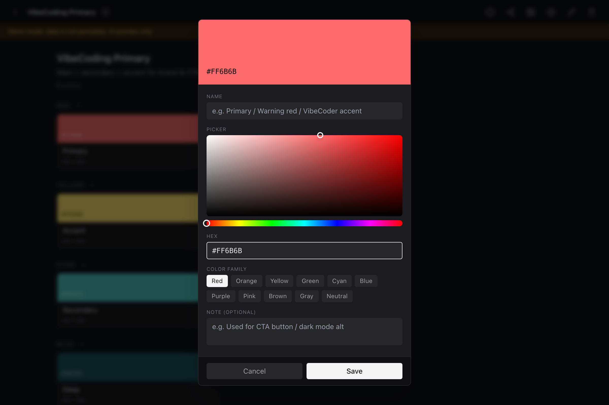
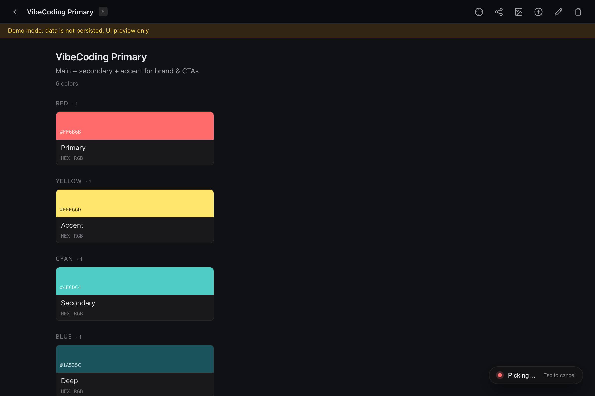

# OpenColor

A lightweight cross-platform desktop color picker for [VibeCoding](https://en.wikipedia.org/wiki/Vibecoding) workflows — pick colors from anywhere on screen, organize them into named palettes, and export a natural-language color system you can paste straight into any AI agent prompt.

Built with **Tauri 2**, **React 18**, **TypeScript**, **Vite**, and **Rust**.

[English](README.md) · [简体中文](README.zh-CN.md)

---

## Screenshots

> Drop screenshots into `screenshots/` and they'll show up here. Suggested: `main.png`, `picker.png`, `editor.png`.

| Main window — palette list | Color editor with HSL picker | On-screen color picker |
| --- | --- | --- |
|  |  |  |

---

## Features

- **Screen picking** — click anywhere on the screen to capture a color, with a live preview card that follows your cursor.
- **Manual entry** — type a HEX value (with 3-char shorthand support: `#f0c` → `#FF00CC`) or pick visually from a custom HSL picker.
- **Import from image** — drop in a screenshot or photo; OpenColor quantizes the dominant colors and lets you multi-select which to add.
- **Named palettes** — group colors into palettes, tag each color with a role (Primary / Accent / …), family (Red / Cyan / …), and free-form note.
- **Export as natural language** — copy a palette as a prompt-ready description: *"请使用以下配色体系: 主色 #FF6B6B (RGB: 255,107,107) …"* — works for both English and Chinese agents.
- **i18n + dark mode** — full English & Simplified Chinese translations; light / dark / system theme.
- **Tiny footprint** — the bundled app is ~10 MB (Tauri's native shell, no Electron, no embedded Chromium beyond the system WebView).

---

## Quick start

```bash
# Requires Node ≥ 18, pnpm, Rust toolchain, and platform deps (see below)
pnpm install
pnpm tauri:dev
```

The first build takes a few minutes while Cargo compiles the Rust backend. After that, hot reload works.

### Demo mode (no Tauri)

If you only want to preview the UI without installing platform-specific screen capture deps:

```bash
pnpm dev
# then open http://localhost:1420/?demo=1
```

Demo mode loads three sample palettes (`VibeCoding Primary`, `Dark mode alt`, `Empty palette`) from `src/lib/demoData.ts`. Edits are not persisted — they live in memory only. Screen picking is disabled in this mode; the "Pick" button inserts a random color from the demo set instead.

---

## Build & ship

```bash
pnpm tauri:build
```

Tauri produces a native bundle for the host platform:

| Platform | Output |
| --- | --- |
| macOS | `.app` and `.dmg` (Apple Silicon + Intel) |
| Windows | `.msi` and `.exe` |
| Linux | AppImage, `.deb`, `.rpm` |

Cross-compilation is possible but not officially supported — build on each target OS for the cleanest result.

---

## Platform support

The palette UI, manual color editing, and export are cross-platform. Screen picking depends on the host:

| Platform | Status |
| --- | --- |
| macOS 12+ | ✅ Requires Screen Recording permission (granted once in System Settings → Privacy & Security). |
| Windows 10/11 | ✅ Works out of the box. Some multi-monitor edge cases pending QA. |
| Linux X11 | ✅ Works. May require `xcap` build deps (`libxcb`, `libxrandr`). |
| Linux Wayland | ❌ Not supported. Wayland restricts global pointer hooks by design; switch to an X11 session to use the picker. |

When picking is unavailable, OpenColor stays usable: manual HEX entry, the HSL picker, and image import all work.

### Platform prerequisites

- **macOS** — Xcode Command Line Tools (`xcode-select --install`).
- **Windows** — Microsoft Visual Studio C++ Build Tools, WebView2 runtime (preinstalled on Win11).
- **Linux** — `libwebkit2gtk-4.1-dev`, `libssl-dev`, `libayatana-appindicator3-dev`, `librsvg2-dev`. See the [Tauri prerequisites guide](https://tauri.app/start/prerequisites/) for the canonical list.

---

## Known limitations

- **No persistent window state plugin** — the OS preserves window size and position across hide/show, but if you delete and recreate the app config you'll get the default 640×480.
- **Image import** caps at 12 dominant colors per palette to keep extraction fast on large images.
- **Picker accessibility on Linux** — `rdev`'s global mouse hook may need root or `uinput` permissions on some Wayland-adjacent setups.
- **`macos-private-api` is enabled** — required for the transparent always-on-top picker window. **This is one of the reasons OpenColor cannot be distributed via the Mac App Store.** Self-distribute via `.dmg` / Homebrew instead.
- **No tests yet** — the project is small enough to manually verify, but PRs adding tests (especially around the picker state machine in `src-tauri/src/picker.rs`) are very welcome.

---

## Architecture

```
┌─────────────────────────────┐
│  Main Window (React UI)     │  ← palettes list, color grid, editor, export
└─────────────────────────────┘
         │ IPC (tauri::command)
         ▼
┌─────────────────────────────┐
│  Rust Core                  │
│  - palette.rs   (CRUD)      │
│  - storage.rs   (JSON I/O)  │
│  - picker.rs    (FSM)       │  ← state machine: Idle → Picking → Confirmed
│  - platform.rs  (perms)     │
└─────────────────────────────┘
         │ xcap::Monitor::capture_region
         ▼
┌─────────────────────────────┐
│  Picker Window (transparent)│  ← cursor-following swatch, click to commit
│  - transparent: true        │
│  - always_on_top: true      │
│  - decorations: false       │
└─────────────────────────────┘
```

Source layout:

- `src/` — React + TypeScript UI
  - `components/` — `App`, `Toolbar`, `PaletteCard`, `ColorGrid`, `ColorEditor`, `HslPicker`, `ImageImportDialog`, `ExportDialog`, `SettingsView`, …
  - `lib/` — `tauri.ts` (IPC wrapper), `format.ts` (HEX/RGB/HSL conversion), `quantize.ts` (median-cut for image import), `export.ts` (natural-language serializer), `demoData.ts`
  - `i18n/` — `en.json`, `zh-CN.json`
- `src-tauri/` — Rust backend
  - `src/` — one file per concern (palette / storage / picker / platform)
  - `picker.html` — the transparent picker window (no React, just vanilla DOM + `listen`/`emit`)
  - `tauri.conf.json` — bundle + window config
  - `capabilities/default.json` — minimal capability set
- `picker.html` (repo root) — bundled into the Tauri build, served as the `picker` window URL.

---

## Contributing

See [CONTRIBUTING.md](CONTRIBUTING.md) for setup, code style, and PR process. Short version: open an issue first for non-trivial changes, keep PRs focused, and make sure `pnpm build` and `cargo check` pass.

---

## License

[MIT](LICENSE) © Freakz2z