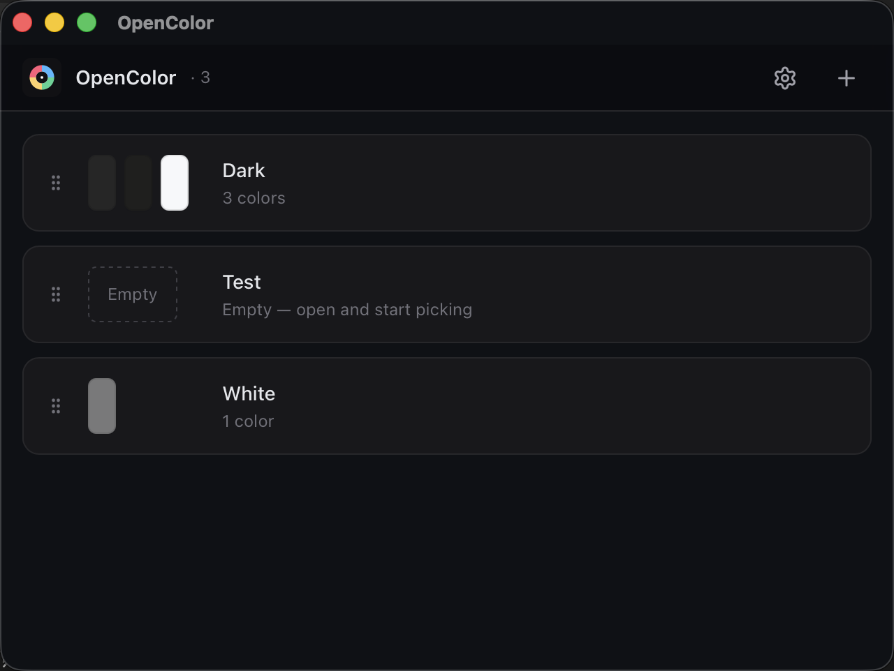

<div align="center">


# OpenColor

一个轻量的桌面取色工具，用于收集、整理和导出设计及 AI 辅助开发所需的配色方案。

[](https://github.com/Freakz2z/OpenColor/releases/latest)
[](https://github.com/Freakz2z/OpenColor/actions/workflows/ci.yml)
[](LICENSE)
[](https://tauri.app/)
[](https://react.dev/)
[](https://www.rust-lang.org/)
[](#%E5%B9%B3%E5%8F%B0%E6%94%AF%E6%8C%81)

[English](README.md) · [简体中文](README.zh-CN.md) · [贡献指南](CONTRIBUTING.md) · [发行版](https://github.com/Freakz2z/OpenColor/releases) · [更新日志](.github/RELEASE_NOTES_v0.2.0.md)

</div>



## 功能

- 从屏幕任意位置取色，并显示跟随光标的实时预览。
- 创建、拖拽排序、重命名和删除调色板。
- 使用 HEX、RGB 和 HSL 编辑颜色。
- 从图片中提取主要颜色。
- 将配色导出为适合提示词使用的自然语言。
- 支持简体中文、英文、亮色和暗色主题。

## 平台支持

| 平台 | 屏幕取色 |
| --- | --- |
| macOS 12+ | 支持，需要屏幕录制和辅助功能权限。 |
| Windows 10/11 | 支持。 |
| Linux X11 | 支持。 |
| Linux Wayland | 不支持，Wayland 会限制全局指针监听。 |

屏幕取色不可用时，手动编辑、图片导入、调色板管理和导出功能仍可正常使用。

## 开发

需要 Node.js 18+、pnpm、Rust，以及对应平台的 [Tauri 前置依赖](https://tauri.app/start/prerequisites/)。

```bash
pnpm install
pnpm tauri:dev
```

仅在浏览器中预览：

```bash
pnpm dev
# http://localhost:1420/?demo=1
```

检查与构建：

```bash
pnpm test
pnpm build
(cd src-tauri && cargo test --all-targets)
pnpm tauri:build
```

推送 `v*` 标签后，发布流水线会构建 Windows、Linux、Intel macOS 和 Apple Silicon macOS 安装包，并创建 GitHub Release 草稿。

## 技术栈

Tauri 2 · React 18 · TypeScript · Vite · Rust

## 协议

[MIT](LICENSE)
